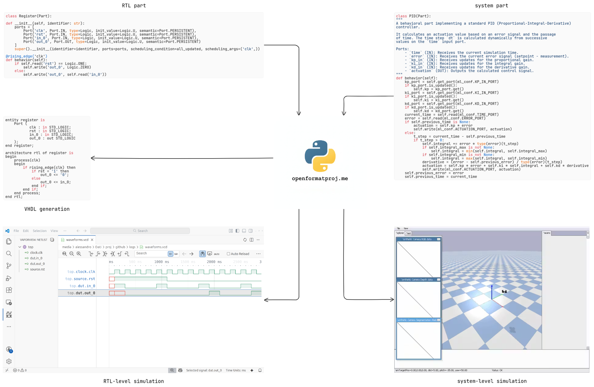

# Introduction

The `me` Python framework provides a streamlined workflow for digital design:

1.  **Define**: Describe hardware behavior using a specific class (`ml.Part`).
2.  **Simulate**: Verify logic with Python-based testbenches and VCD visualization.
3.  **Generate**: Automatically produce synthesizable VHDL/Verilog code.
4.  **Integrate**: Build complex systems by mixing different domains (hardware, software, mechanics...) and simulate them.

This approach bridges the gap between high-level modeling and hardware implementation.

---



---

# Defining a RTL Part

Defining a register is as simple as defining a Python class with ports and behavior.

```python
from ml.engine import Part, Port
from ml.strategies import all_updated
from me.domains.hardware.digital import Logic, rising_edge

class Register(Part):
    def __init__(self, identifier: str):
        ports = [
            Port('clk', Port.IN, type=Logic, init_value=Logic.U, semantic=Port.PERSISTENT),
            Port('rst', Port.IN, type=Logic, init_value=Logic.U, semantic=Port.PERSISTENT),
            Port('in_0', Port.IN, type=Logic, init_value=Logic.U, semantic=Port.PERSISTENT),
            Port('out_0', Port.OUT, type=Logic, init_value=Logic.U, semantic=Port.PERSISTENT)
        ]
        super().__init__(identifier=identifier, ports=ports, scheduling_condition=all_updated, scheduling_args=('clk',))
    @rising_edge('clk')
    def behavior(self):
        if self.read('rst') == Logic.ONE:
            self.write('out_0', Logic.ZERO)
        else:
            self.write('out_0', self.read('in_0'))
```

---

# Simulation: defining the stimulus source

The stimulus source generates the stimuli for the DUT.

```python
from ml.engine import Part, Port
from ml.strategies import all_updated
from me.domains.hardware.digital import Logic, rising_edge

class Source(Part):
    def __init__(self, identifier: str):
        ports = [
            Port('clk', Port.IN, type=Logic, init_value=Logic.U, semantic=Port.PERSISTENT),
            Port('rst', Port.OUT, type=Logic, init_value=Logic.U, semantic=Port.PERSISTENT),
            Port('out_0', Port.OUT, type=Logic, init_value=Logic.U, semantic=Port.PERSISTENT),
        ]
        super().__init__(identifier, ports=ports, scheduling_condition=all_updated, scheduling_args=('clk',))
        self.cycle = 0
    @rising_edge('clk')
    def behavior(self):
        # Assert reset for the first few cycles
        self.write('rst', Logic.ONE) if self.cycle < 5 else self.write('rst', Logic.ZERO)
        # Change input data periodically
        self.write('out_0', Logic.ONE) if self.cycle % 4 == 0 else self.write('out_0', Logic.ZERO)
        self.cycle += 1
```

---

# Simulation: defining the testbench

The testbench orchestrates the simulation, wiring the DUT to sources and sinks.

```python
from ml.engine import Part, EventQueue
from ml.strategies import Execution
from me.parts.hardware.digital import vcd_monitor

@vcd_monitor('logs/waveforms.vcd', {
    'clock.clk': 'clock.clk',
    'source.rst': 'source.rst',
    'dut.in_0': 'source.out_0',
    'dut.out_0': 'dut.out_0'
}, time_path='clock.time_port')
class Testbench(Part):
    def __init__(self, identifier: str):
        event_queues = [EventQueue('timer_q', EventQueue.IN, size=1)]
        parts = {
            'clock': Clock('clock'),
            'source': Source('source'),
            'dut': Register('dut'),
            'sink': Sink('sink')
        }
        super().__init__(identifier, parts=parts, event_queues=event_queues, execution_strategy=Execution.sequential())
        self.wire_event('timer_q', 'clock.time')
        self.wire('clock.clk', 'source.clk')
        self.wire('clock.clk', 'dut.clk')
        self.wire('source.rst', 'dut.rst')
        self.wire('source.out_0', 'dut.in_0')
        self.wire('dut.out_0', 'sink.in_0')
```

---

# Simulation: inspecting waveforms

VCD generation allows for immediate waveform inspection.


---

# Structure Visualization

The testbench structure can be visualized directly from the Python definition.


---

# Automatic Code Generation

Production-ready VHDL code can be generated from the model using AI (e.g. `gemini-2.5-flash-lite`).

```vhdl
entity register is
    Port (
           clk : in STD_LOGIC;
           rst : in STD_LOGIC;
           in_0 : in STD_LOGIC;
           out_0 : out STD_LOGIC
    );
end register;

architecture rtl of register is
begin
    process(clk)
    begin
        if rising_edge(clk) then
            if rst = '1' then
                out_0 <= '0';
            else
                out_0 <= in_0;
            end if;
        end if;
    end process;
end rtl;
```

---

# System Integration: building the architecture

Since an RTL component is a `ml.Part`, it is not isolated: it can be integrated inside complex structures for simulation and system-level code generation.


---

# System Integration: verifying the architecture

Combine digital logic and hardware accelerators with physics models, control algorithms and 3D scenarios (PyBullet, MuJoCo...) to validate hardware-software interactions and architectural decisions earlier.


---

# Check it out!

Interested in contributing or in building something yourself? Or simply just curious? See below!

-   Interested in RTL? Start here: [`me/demos/rtl`](https://github.com/openformatproj/me?tab=readme-ov-file#rtl)
-   Interested in systems? See the [`multirotor`](https://github.com/openformatproj/multirotor) project